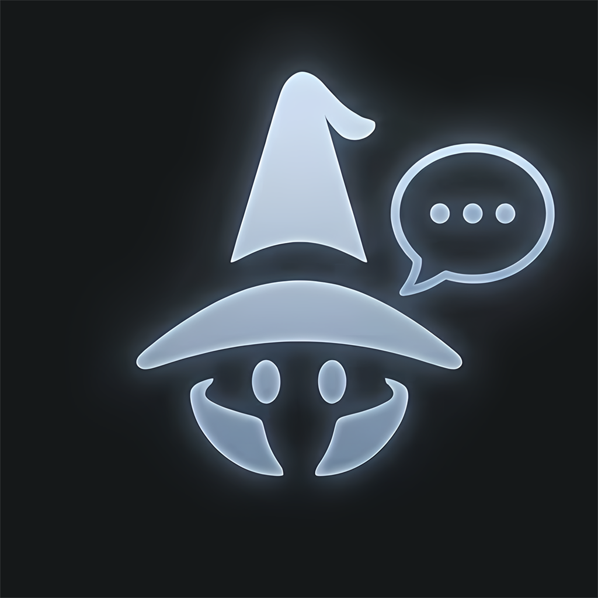
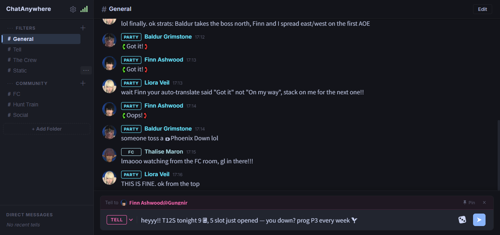
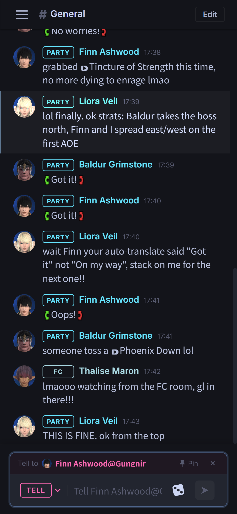
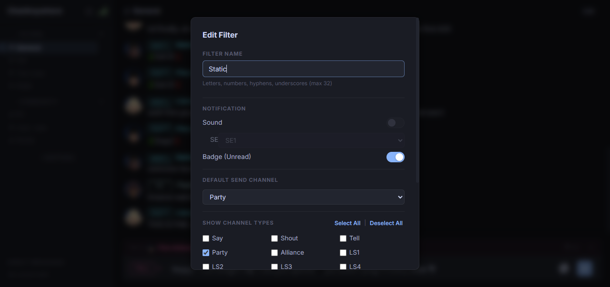
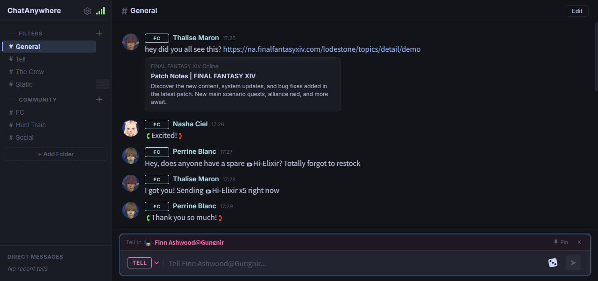
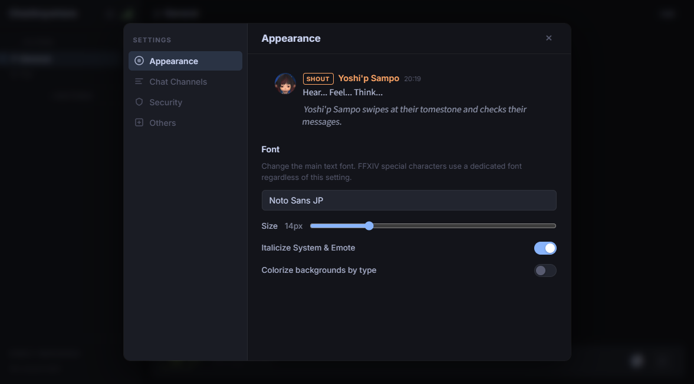

<div align="center">
  
  <h1>ChatAnywhere</h1>
  <p>Read and send your FFXIV in-game chat from any browser — at home or on the go.</p>
</div>

<div align="center">
  
  &nbsp;&nbsp;
  
</div>

ChatAnywhere is a [Dalamud](https://github.com/goatcorp/Dalamud) plugin that runs a lightweight web server inside FFXIV.
It streams your in-game chat to any browser in real time, and lets you send messages back without switching to the game window.

> **A note on ChatTwo:**
> ChatAnywhere started as a personal reimplementation of the ideas first realized by **ChatTwo** — one of the best chat plugins ever made for FFXIV.
> The channel handling, UI concept, and overall approach all owe a deep debt to that project and its author.
> I have enormous respect for ChatTwo. If you haven't tried it, please do.
> *(I would have asked permission before publishing this, but the language barrier made that difficult — I'm sorry for that.)*

---

## Features

### Real-time chat streaming

Messages arrive instantly via Server-Sent Events (no polling).
All FFXIV channel types are supported: **FC, LS1–8, CWLS1–8, Party, Tell, Say, Shout, Yell, Alliance,** and more.

Each message shows the sender's Lodestone avatar, a coloured channel badge, auto-translate bracket rendering (`【 … 】`), and FFXIV item link indicators.

### Custom filters

Create named filters that show only the channel types you care about.
Organise filters into folders and reorder everything with drag-and-drop.

Each filter can have its own:
- **Default send channel** — the channel used when you press Send
- **Unread badge** — highlights the filter tab when new messages arrive while it's not active
- **Sound notification** — plays an in-browser SE sound on new messages



### Tell mode

Click any sender's name to enter **Tell mode** and reply to them directly.
- **Pin** the conversation to keep Tell mode active across multiple sends
- Use the **channel switcher** to switch between Tell and any other channel mid-session
- Recent Tell partners appear in the **Direct Messages** section of the sidebar

### FFXIV special characters

The built-in character picker gives quick access to every FFXIV private-use symbol —
party numbers ①–⑧, raid signs (Attack / Bind / Circle etc.), instance markers, time icons, and more —
so you can type naturally without memorising character codes.

### Link preview

URLs from trusted sites (Lodestone, YouTube, Twitter/X, Twitch, Imgur, and more) automatically render an inline preview card showing the page title, description, and thumbnail.
YouTube links show an embedded player you can watch without leaving the chat window.



### Link safety

Clicking a URL in chat opens a confirmation dialog before leaving the page.
You can whitelist trusted domains so subsequent clicks open immediately without prompting.

### Appearance



- Choose any **Google Font** for the chat window
- Adjust **font size**
- Toggle **italic rendering** for system messages
- Enable **coloured message backgrounds** per channel type (subtle tint behind each message)

---

## Setup

### 1. Add the custom repository

Open **Dalamud Settings → Experimental** and paste the following URL into **Custom Plugin Repositories**:

```
https://raw.githubusercontent.com/twelvehouse/ChatAnywhere/main/pluginmaster.json
```

Click **+**, save, then search for **ChatAnywhere** in the plugin browser and install it.

### 2. Open the chat UI

Once the plugin is loaded and you are logged in to a character, open your browser and go to:

```
http://localhost:3000
```

The page connects automatically and starts streaming your chat.

To access from another device on the same network (phone, tablet, etc.), use your PC's local IP address instead:

```
http://192.168.x.x:3000
```

You can find your local IP by running `ipconfig` in a terminal and looking for the IPv4 address.

<details>
<summary>Accessing ChatAnywhere from outside your home network (Tailscale)</summary>

By default the server only listens on `localhost`, so it is not reachable from other devices.
To access it from your phone or laptop while away from home, the easiest solution is **Tailscale** — a free VPN that creates a private network between your devices with zero port-forwarding setup.

**Steps:**

1. Download and install Tailscale on the PC running FFXIV:
   [tailscale.com/download](https://tailscale.com/download)

2. Install the Tailscale app on the remote device (Android / iOS / another PC) and sign in with the same account.

3. Once both devices appear in your tailnet, find the **Tailscale IP** of your gaming PC in the Tailscale admin panel or the system-tray icon — it looks like `100.x.x.x`.

4. On the remote device, navigate to:

   ```
   http://100.x.x.x:3000
   ```

No port forwarding, no firewall rules, no router configuration needed.

</details>

---

## Acknowledgements

ChatAnywhere would not exist without these projects:

| Project | Role |
|---|---|
| ChatTwo | Original inspiration — concept, channel handling, and UI approach |
| [Dalamud](https://github.com/goatcorp/Dalamud) | Plugin framework and FFXIV game API |
| [NetStone](https://github.com/xivapi/NetStone) | Lodestone character avatar lookups |
| [OpenGraph-Net](https://github.com/ghorsey/OpenGraph-Net) | URL Open Graph preview metadata |
| [Watson.Lite](https://github.com/jchristn/WatsonWebserver) | Embedded HTTP server and SSE support |
| [@dnd-kit](https://dndkit.com/) | Drag-and-drop filter and folder reordering |
| [@tanstack/react-virtual](https://tanstack.com/virtual) | Virtualised message list for large chat histories |

<details>
<summary>How it works (technical overview)</summary>

```
FFXIV game process
 └─ Dalamud plugin (C#)
      ├─ Subscribes to Dalamud chat events
      ├─ Watson.Lite HTTP server (default: port 3000)
      │    ├─ GET  /          → serves the React SPA (bundled into the plugin output at build time)
      │    ├─ GET  /events    → SSE stream; pushes chat messages as JSON in real time
      │    ├─ GET  /history   → paginated message history (loaded on scroll-up)
      │    ├─ POST /send      → injects a message into the game's chat input
      │    └─ GET/PUT /settings → persists filters, folders, and appearance config
      └─ Lodestone character lookups via NetStone for avatar images
           (results cached in browser sessionStorage)

Browser (React + TypeScript SPA, built with Vite)
 ├─ Connects to /events SSE stream on load
 ├─ Renders messages with a virtualised list (@tanstack/react-virtual)
 ├─ Filter sidebar with drag-and-drop reordering (@dnd-kit/sortable)
 ├─ FFXIV Lodestone font (SSF TTF) and icon sprites (GFD) loaded from the plugin server
 └─ Settings and filters persisted server-side via PUT /settings
```

</details>
